# Mobile Genetic Elements in Muskegon Lake, Michigan

## Introduction

Bacteria and archaea are vital components to the biogeochemical cycling of carbon and nutrients, especially in aquatic ecosystems. Heterotrophic microbes directly consume particulate organic matter and is broken down into bioavailable organic and inorganic nutrients that are released for other microbes to consume [@grossartEcologicalConsequencesBacterioplankton2010].

Pelagic bacteria can be classified into fractions as truly free-living (FL), truly particle-associated (PA), and bacteria that alternate between the two lifestyles (generalists) [@grossartEcologicalConsequencesBacterioplankton2010]. FL microbes tend to have small genomes, do not have chemotaxis ability, and have adapted to live in a low concentration of nutrients [@bachmannEnvironmentalDriversFreeLiving2018]. On the other hand, PA microbes have larger genomes, are capable of chemotaxis to colonize particles, and live in higher nutrient conditions [@bachmannEnvironmentalDriversFreeLiving2018].

Horizontal gene transfer (HGT) between microbes are mediated by mobile genetic elements (MGEs) such as plasmids and bacteriophages [@haudiquetSelfishPromiscuousSometimes2022]. Plasmids are small circular DNA fragments that are separate from chromosomal DNA, replicate independently, and are transferred horizontally by conjugation [@sanmillanEvolutionPlasmidMediatedAntibiotic2018]. Plasmids are of growing concern as they are capable of disseminating antibiotic resistance genes and have the potential to create multi-drug resistant "super bugs" [@sanmillanEvolutionPlasmidMediatedAntibiotic2018]. Plasmids can be classified as self-transmissible or mobilizable. Self-transmissible plasmids carry their own conjugation machinery to mobilize themselves into recipient cells. Mobilizable plasmids do not encode their own machinery to mobilize themselves but instead hitch a ride with the self-transmibble plasmids to be disseminated into recipient cells [@alderliestenEffectDonorrecipientRelatedness2020] [@smillieMobilityPlasmids2010]. Self-transmissible plasmids that are capable of conjugation are only conjugative for \~0.1% of their life cycle as conjugative is an energetically taxing process [@smillieMobilityPlasmids2010].

Bacteriophages (phages) are the most abundant biological entity in the aquatic environment. Phages play a crucial role in shaping microbial populations and it is estimated that 20-40% of cells are lysed and influence biogeochemical cycling [@brownEcologicalFunctionalRoles2022].

Yet in freshwater aquatic environments, the ability to annotate MGEs such as plasmids and phages from short read sequencing data has been limited. Understanding MGEs from sequencing data is critical to understand plasmid and phage diversity.

In this study we have two main forms of analyses: the metagenome assembled genome (MAG) level and we sought to analyze 346 metagenome assembled genomes (MAGs) using metagenomic data from sixteen samples.

In this study we sought to analyze 346 to taxonomically identify members of the community while also analyzing the whole community with our assembled contigs. By using both MAGs and assembled contigs, we will be able to understand microbial communities found in Muskegon Lake, Michigan.

## Methods

### Sample Collection

Samples were collected during July and September in 2014 and 2015 in Muskegon Lake, Michigan at a depth of 2 meters from two sampling stations (Outlet and Deep) [@schmidtMicrohabitatsAreAssociated2020]. The two sampling stations were selected for their similarity in microbial communities. Samples were collected with vertical Van Dorn samplers Microbial cells for DNA extraction were collected by sequential in-line filtration onto a 3 μm isopore polycarbonate filter for the particle-associated fraction and a 0.22 μm polyethersulfone membrane filter for the free-living fraction [@schmidtMicrohabitatsAreAssociated2020]. DNA extractions were performed by using an optimized method based on the AllPrep DNA/RNA/miRNA Universal kit [@schmidtMicrohabitatsAreAssociated2020] [@mccarthyRNAPreservationAgents2015]. DNA was sequenced using Illumina HiSeq 2500.

### Assembly and binning

Sequences from each sampled were individually assembled and co-assembled within free-living and particle-associated samples into contigs with MEGAHIT v1.0.6 [@iMEGAHITV1Fast2016].

Bacterial isolates were then binned to create a total of 346 metagenome-assembled genomes, known as MAGs.

### geNomad

To identify and classify mobile genetic elements (MGEs) such as plasmids and phages, geNomad is a bioinformatic tool for metagenomic data sets. GeNomad employs a hybrid approach by using alignment-free models to classify reads from the nucleotide sequences while gene-based classification methods search online databases such as Prodigal and MMseqs2 and alignments to identify marker proteins to identify the sequence [@camargoIdentificationMobileGenetic2023]. From utilizing these two methods, geNomad produces an output created by the sequence and marker branches to generate an aggregated classification to bolster the strength of each classification method [@camargoIdentificationMobileGenetic2023]. Additionally, geNomad's classification models utilize a calibrated score of the probability of the prediction which allows users to compute false discovery rates to make informed decisions and to adjust the assigned labels of some sequences to accurately identify plasmid and viruses [@camargoIdentificationMobileGenetic2023]. For sequences that are classified as viral by geNomad's markers, they are then assigned to taxa defined by the International Committee on Taxonomy of viruses by created the taxonomies of all genes to create a single consensus lineage for that sequence [@walkerRecentChangesVirus2022] [@camargoIdentificationMobileGenetic2023].

### Phylogenetic Classification

The taxonomic classification of MAGs was classified by GTDB-tk v2.3.1 [@chaumeilGTDBTkV2Memory2022]. An unrooted phylogenetic tree of 346 MAGs was created using the GTDB-tk classify_wf to produce a multiple sequence alignment of the BAC120 market set.

The tree was constructed with FastTree using the JTT+CAT model [@priceFastTreeComputingLarge2009]

### Estimating Lengths of Contigs and MAGs

As we do not have a precise number of our DNA lengths, we estimate the lengths of the reads to obtain a value so that we can normalize our lengths to the number of genes encoded

For the assembly level we  multiplied the number of total sequence reads by the average length and then divided by Mb (1,000,000) to estimate length

For the MAG level, we were able to estimate the lengths by referring to our checkm file which was able to approximate bin length and completeness (completeness of bin refers to how many single copy proteins are found). We multipled this number and then divided by Mb (1,000,000) to estimate length.

## Hypothesis

When considering aquatic bacterial fractions or lifestyles, truly particle-associated are in direct contact with each other on particles allowing for more opportunities to engage in HGT. Thus we hypothesize this direct cell-to-cell contact allows for more opportunities to engage in conjugation and be hunted by phages.

## Results

### Assembly Level View

##### Plasmids

The assembly level view is based on the contigs from the 0.22 μm (free-living fraction) and 3.0 μm (particle-associated fraction) filter papers. At this level, this is the whole community view where we do not know taxonomically "who" is in our samples as this was done prior to binning. When first considering the relative abundance of plasmid encoded genes between our two filters, we hypothesized that the particle-attached filter would have a higher abundance than the free-living filter due to the increased cell-to-cell contact (Fig. 1). Yet we find that there is no significant difference between the number of plasmid-encoded genes between our two filter fractions per Mb.

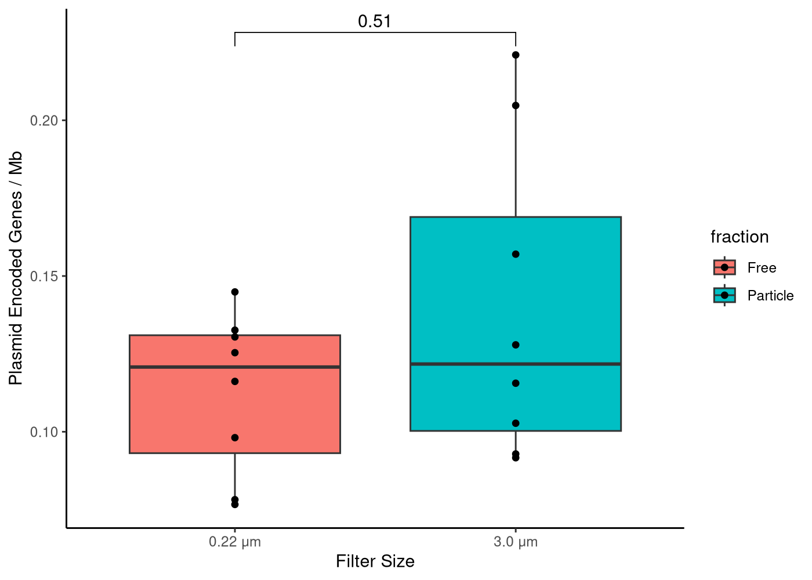

To understand how these plasmids may be disseminated throughout the environment, it is important to see what kinds of conjugation machinery as present on plasmids. Albeit conjugation is a transient process of a microbe's lifecycle, the types of genes encoded can give us an insight how microbes are being disseminated.

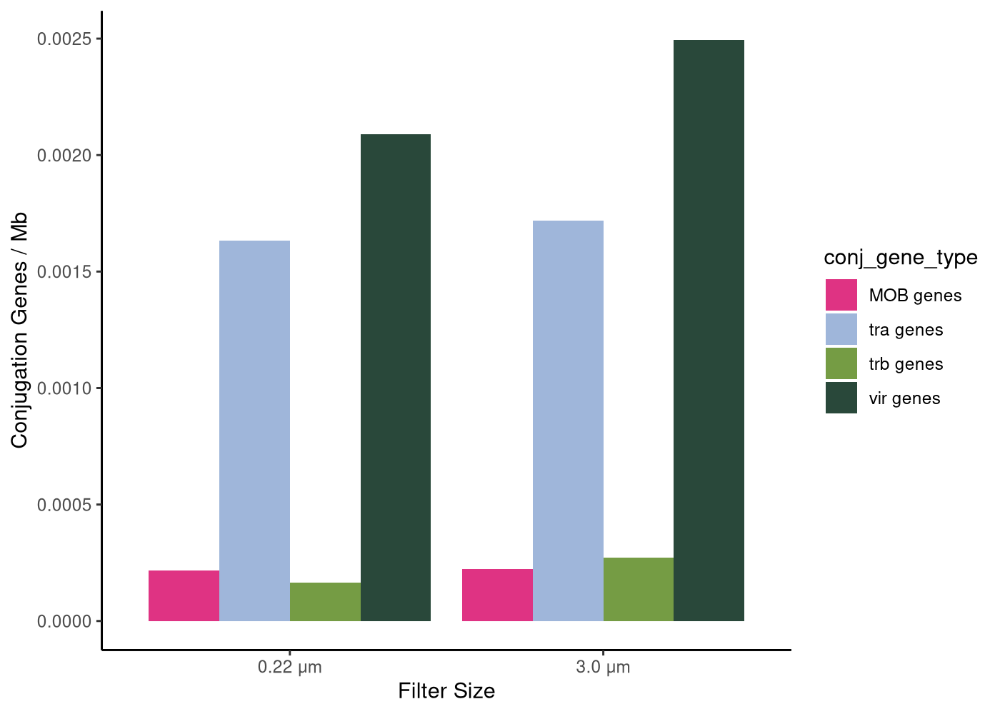

**Fig. 2.** Conjugation genes between filter sizes

When comparing the relative abundances of conjugation genes between both filter sizes, it is interesting to note that both sizes reflect roughly equal amount of conjugation genes. *MOB* genes refer to the conjugation machinery found on mobilizable plasmids that hitchhike a ride with self-transmissible plasmids that encode *tra, trb,* and *vir* genes in type IV secretion systems [@smillieMobilityPlasmids2010].

##### Phages

Next, we hypothesized the relative abundance of phage-encoded genes on the particle-attached filter would have a higher abundance than the free-living filter due to the increased cell-to-cell contact. Yet we find the opposite, that there is a higher relative abundance of phage-encoded genes on the 0.22 μm (free-living filter) (fig.3).

**Fig. 3.** Phage-encoded genes per Mb

#### 346 MAGs

To taxonomically identify what microbes are present within our data set, MAGs were identified through statistical modeling in these two filter sizes and by calculating differencial abundances. A total of 346 MAGs were created with statistically significant bins categorized as free-living or particle-associated lifestyles. Those not statistically significant were considered to be generalists (from Gus's repo not sure how to cite).

To understand the distribution of our data set, we find that the majority of our MAGs belong to generalist lifestyles (66.8%) (Fig. 4)

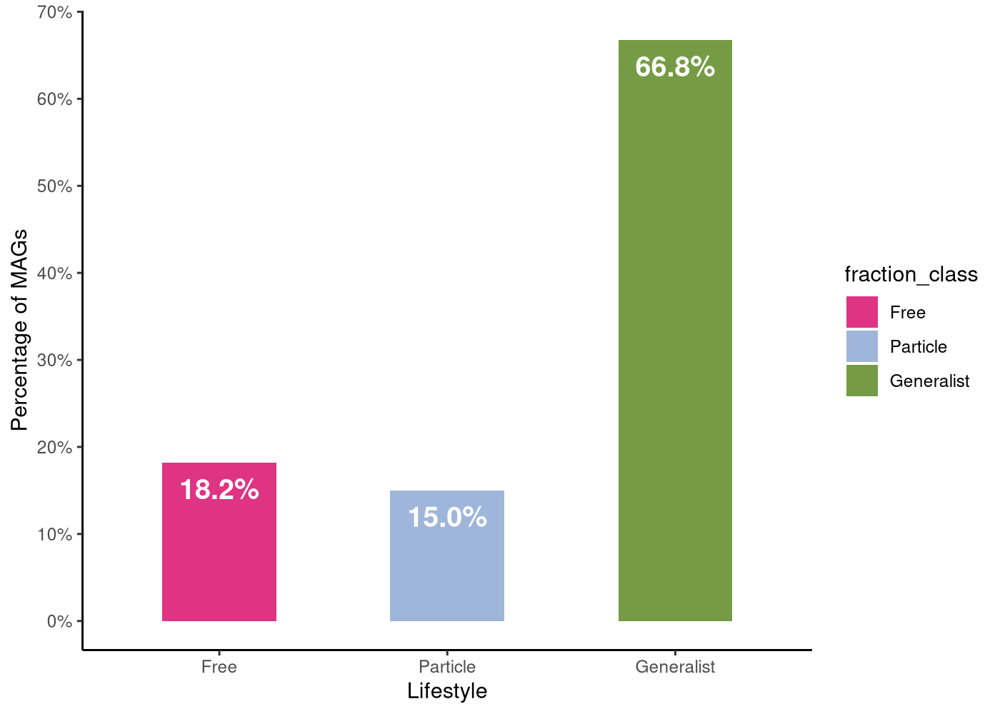

**Fig. 4.** Percentage of MAGs

##### Plasmids

#### How does bacterial lifestyle impact the number of plasmid-encoded genes?

Of our 346 MAGs we sought to ask the same questions as our assembly level view to ... Similarly to the assembly level view, we hypothesized that there are more plasmid-encoded genes in the particle-attached or generalist lifestyles than free-living due to direct cell-to-cell contact.

In figure 5 a density plot illustrates that the greatest density is approximately 0 plasmid-encoded genes per Mb per MAG. We find that while there are relatively similar distributions of plasmid-encoded genes across MAGs, free-living microbes do have a different distribution which was an unexpected finding. The free-living microbes have a greater peak with approximately 0.2 and 0.4 plasmid-encoded genes. The generalist fraction has many peaks with notably one demonstrating that approximately 1.2 plasmids genes are encoded.

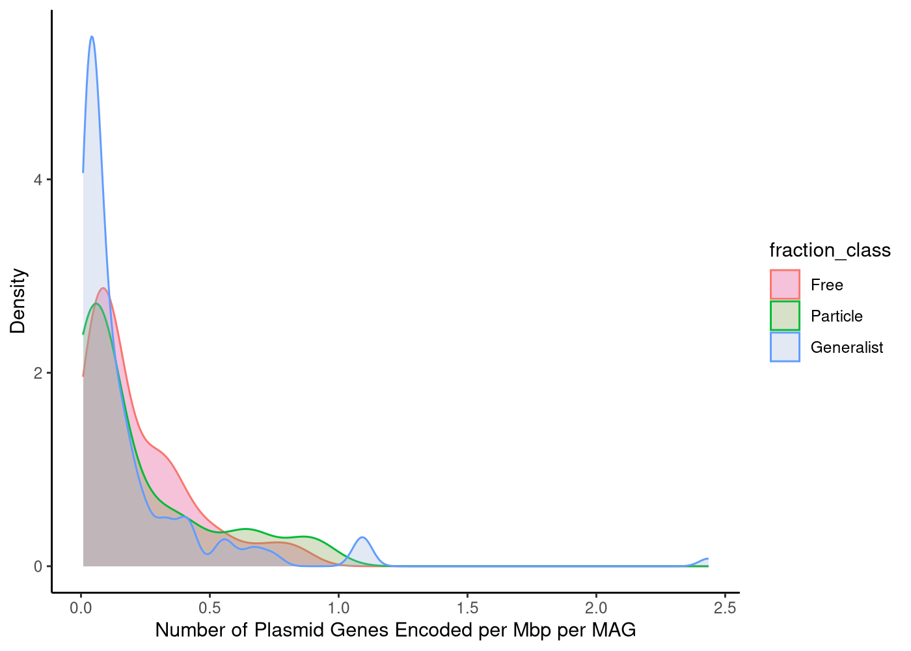

**Fig. 5.** Density plot of Number of Plasmid-Encoded Genes per Mb per MAG

Similarly, when looking at a boxplot view of the number of plasmid-encoded genes between each lifestyle, in fig. 6 we find that there is a significant difference between free and generalist lifestyles. We find that the median in the free-living fraction is surprisingly higher than the particle-attached fraction which was an unexpected finding.

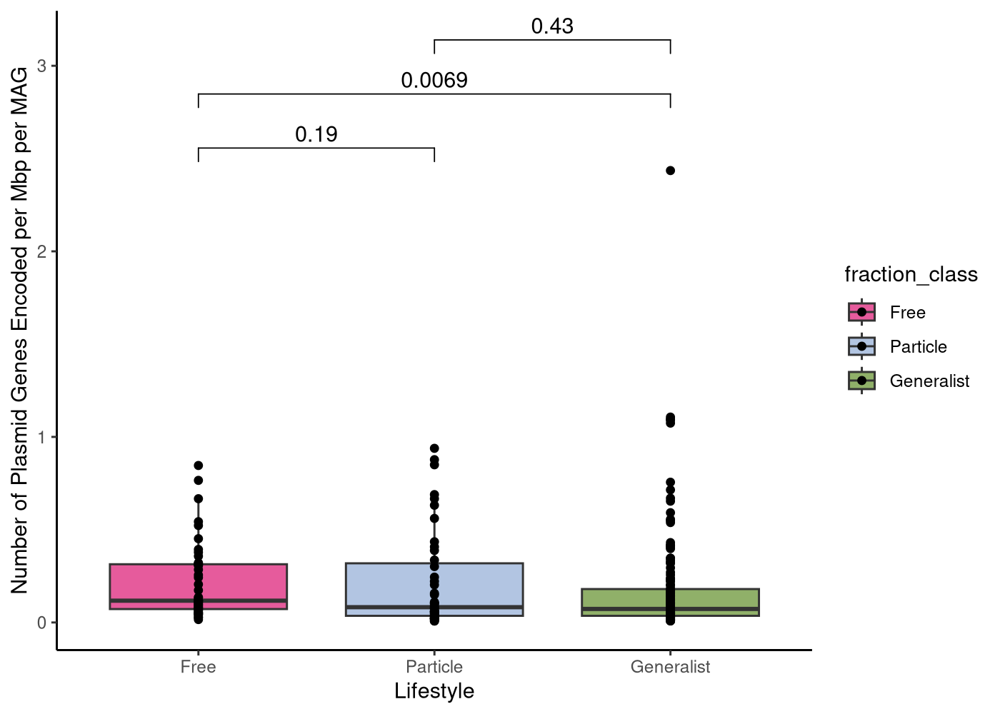

**Fig. 6.** Boxplot of Number of Plasmid-Encoded Genes per Mb per MAG

#### How the number of plasmid-encoded genes vary by taxonomy?

Next, we sought to understand the taxonomical breakdown of the bacterial lifestyles and the number of plasmid-encoded genes per Mb per MAG. In fig. 7 we find that Verrucomicrobiota and Prototeobacteria are found in all lifestyles but particularly in the generalist lifestyle, Proteobacteria encodes the greatest amount of plasmid genes (\~2.5).

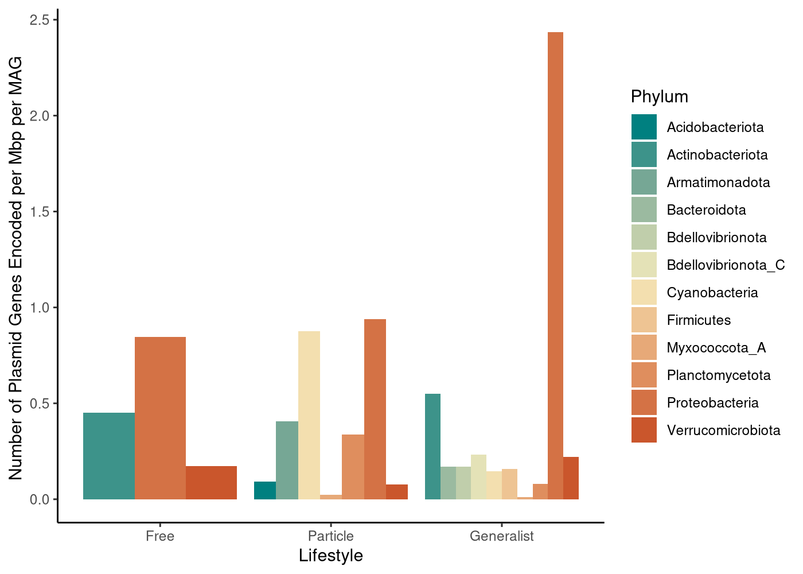

**Fig. 7.** Number of plasmid-encoded genes between lifestyles and taxonomy

We find that the trait of plasmid-encoded genes had a strong phylogenetic signal across our MAGs using both Pagel's lambda (𝛌 = 0.741024, p = 3.056e-45) and Bloomberg's K (K = 0.0053217, p-value: 0.002002).

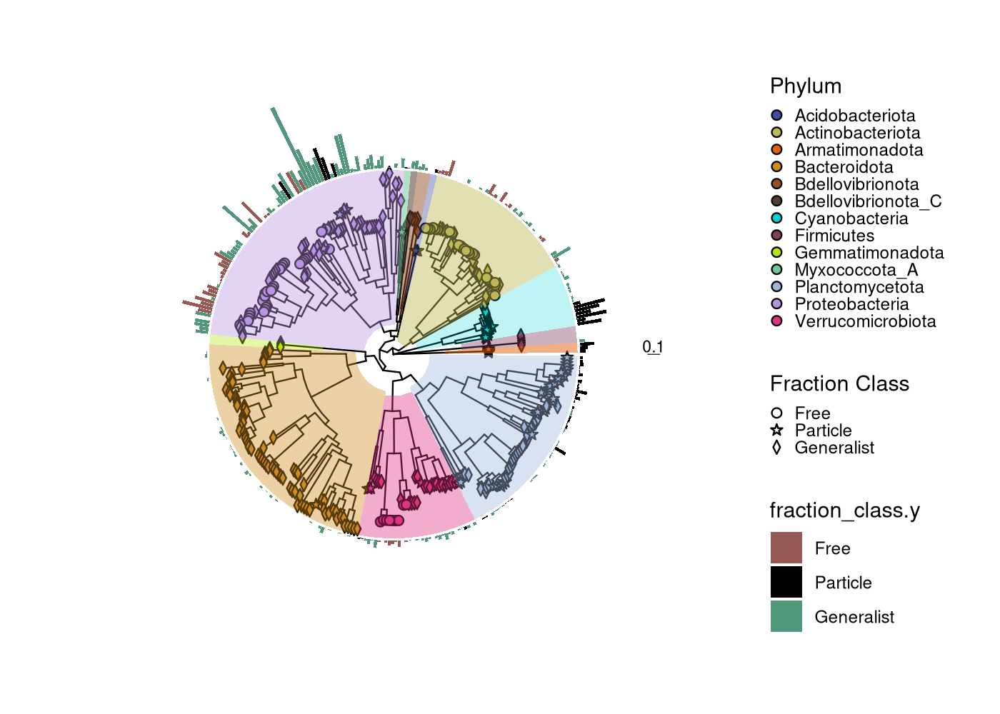

**Fig. 8.** Number of plasmid-encoded genes between lifestyles and taxonomy

#### Is there a difference in conjugation gene abundance between lifestyles?

In order to disseminate within communities, plasmids encode conjugation genes to be transferred into recipient cells. Plasmids can generally be categorized as self-transmissible or mobilizable (nonmobilizable plasmids are those that are not conjugative or mobilizable but are not the focus of this study [\@smillieMobilityPlasmids2010a]. We hypothesize that there would be more conjugation genes in the particle-attached or generalist lifestyles due to the direct cell-to-cell contact. In fig. 9 we find that *MOB* and *vir* genes are found in lifestyles. *MOB* genes are found on mobilizable plasmids which hijack the machinery of self-transmissible plasmids that encode genes such as *vir, tra,* and *trb* genes. We find that *tra* genes are only found in particle-attached and generalist fractions. 

**Fig. 9.** Conjugation Genes Between Lifestyles

In fig. 10 we find that conjugation genes are strongly dependent on phylogenetic relationships which indicate a strong phylogenetic signal with Pagel's lambda (𝛌 = 0.992932, p = 3.56436e-54) and Bloomberg's K (K = 0.0326016, p-value = 0.001001).

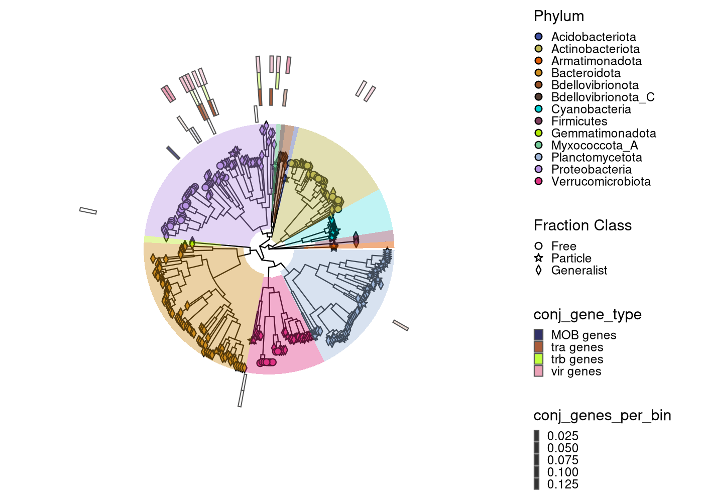

**Fig. 10.** Conjugation Genes Suggest Strong Phylogenetic Signal

##### Phages

#### Is there a difference in phage-encoded gene abundance between lifestyles?

Next we sought to understand the difference in phage-encoded gene abundance between lifestyles. We hypothesized that there would be more phage-encoded genes in the particle-attached or generalist lifestyles due to the direct cell-to-cell contact.

In fig.11 a density plot illustrates that the greatest density is approximately 0 phage-encoded genes per Mb per MAG. We find that while there are relatively similar distributions of phage-encoded genes across MAGs, free-living microbes do have a different distribution which was an unexpected finding. Free-living microbes tend to have greater density peaks than generalist and particle-attached lifestyles. Yet there are more generalist species encoding more phage genes.

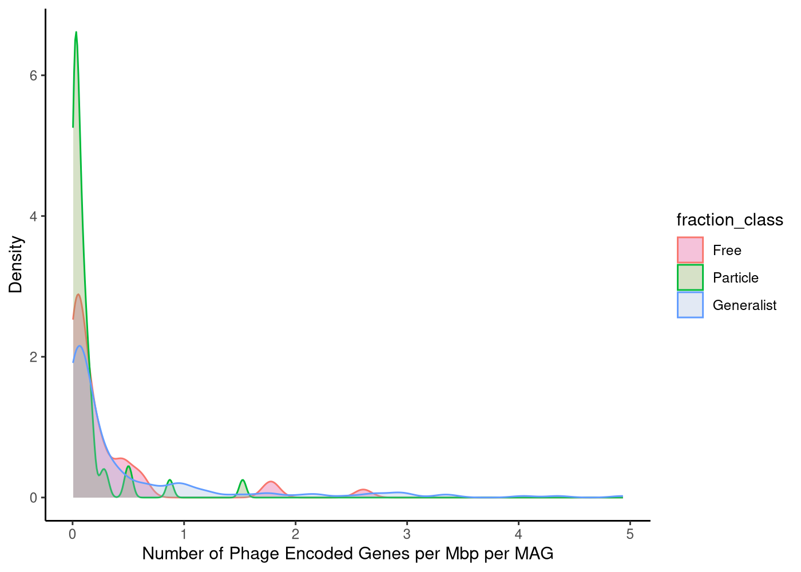

**Fig. 11.** Density plot of Number of Phage-Encoded Genes per Mb per MAG

Similarly, when looking at a box plot view of the number of phage-encoded genes between each lifestyle, in fig. 12 we find that there is a significant difference between particle-attached and generalist lifestyles. Generalist microbes have the highest number of phage-encoded genes per Mb per MAG.

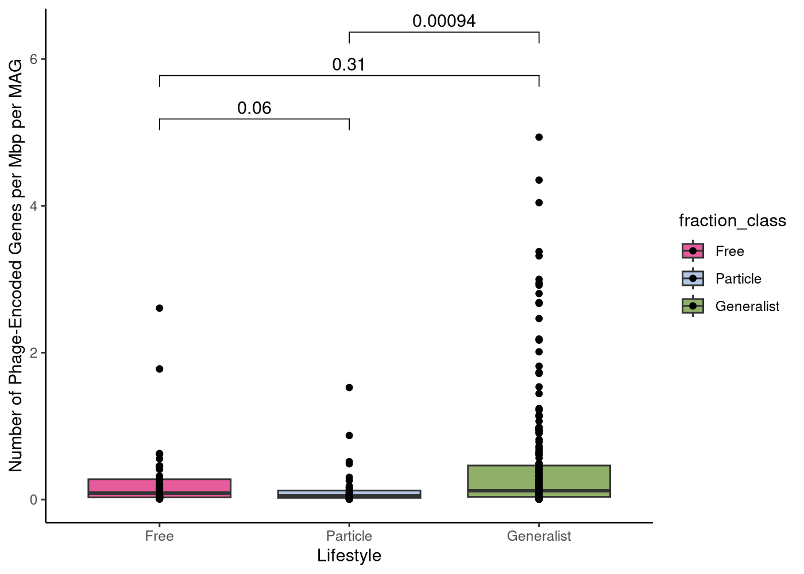

**Fig. 12.** Box plot of Number of Phage-Encoded Genes per Mb per MAG

**What are the most prevalent phylum of phages in each bacterial phylum?**

To understand the taxonomical breakdown of what phylum phages are found in our MAGs, in fig. 13 we find that the most prevalent phages found are Uroviricota, Unclassified, and Nucleoviricota. We find that Uroviricota and Unclassified infects all phyla within our MAGs. While Uroviricota has a greater number of phage genes encoded per Mb per MAG, our study draws importance to understand what the unclassified phages are identified in our dataset.

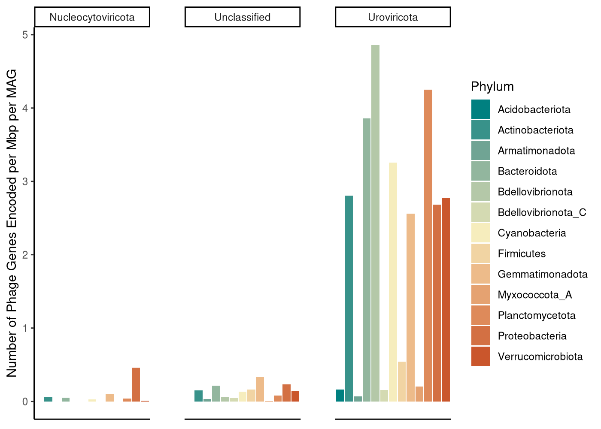

**Fig. 13.** Phage Taxonomical Breakdown of the Number of Phage-Encoded Genes per Mb per MAG

To better understand which phages infect in each lifestyle, fig. 14 finds Uroviricota infects all lifestyles with the generalist fraction having the greatest number of phage-encoded genes. Additionally, not only does Uroviricota infect the free-living fraction more than the particle-attached fraction, but the free-living fraction has more phages infecting that encode a greater number of phage genes than the particle lifestyle.

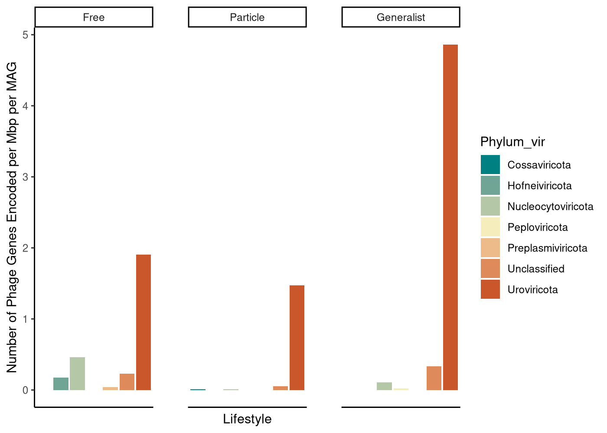

**Fig. 14.** Phage Taxonomical Breakdown of the Number of Phage-Encoded Genes per Mb per MAG by Bacterial Lifestyle

In fig. 15 we find that phage-encoded genes are not dependent on phylogenetic relationships which indicate a weak phylogenetic signal with Pagel's lambda (𝛌 = 0.242194, p = 0.00922661) and Bloomberg's K (K = 0.00182091, p-value = 0.906907). Furthermore, this indicates that the observed trait of phage-encoded genes is less influenced by the evolutionary relationships among our 346 MAGs. This trait is much less variable than expected under a Brownian Model which suggest a very strong conservatism or constraint in the evolution of phage-encoded genes. 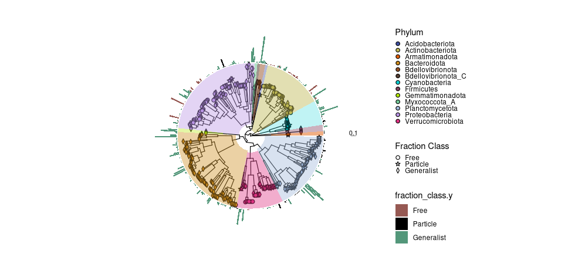

**Fig. 15.** Phage-Encoded Genes Suggest Weak Phylogenetic Signal

## Discussion

Mobile genetic elements (MGEs) are ubiquitous in nature and MGEs such as plasmids and phages play important roles in microbial evolution by providing fundamental sources of diversity. Horizontal gene transfer is largely mediated by MGEs. With our original hypothesis, we hypothesized that particle-attached and/or generalist lifestyles would have higher amounts of MGEs because of their close proximity to each other. Yet is important to mention that ere are more free-living cells within a given community.

At the assembly level view, we saw no significant difference in plasmid-encoded genes per Mb. We find that conjugation genes have similar distributions to each other in both filter sizes. There is a significant difference in the number of phage-encoded genes per Mb in which there is a greater amount in the 0.22 um filter. This may be due in part of the kill the winner hypothesis.

At the MAG level view, we have 346 MAGs and a majority of them were categorized as generalists (66.8%). In the free-living lifestyle, there is a higher median for plasmid-encoded genes than for generalists per Mb per MAG. Proteobacteria encoded the most plasmid-encoded genes which is seen in the generalist lifestyle. This may be due in part of a database bias where Proteobacteria are better well studied due to their ability to be cultured in a laboratory setting. We also find that conjugation genes vary between lifestyles. *MOB* and *vir* genes are found in each lifestyle but *tra* genes have the highest abundance in the generalist lifestyle which corresponds to Proteobacteria abundance in the generalist lifestyle. The observed trait of plasmid-encoded genes suggests that it is influenced by evolutionary relationships. Additionally, the observed trait of conjugation genes is highly dependent on evolutionary relationships. Generalist microbes have a higher amount of phage-encoded genes per Mbp per MAG. When looking at phage-encoded genes Uroviricota, Nucleocytoviricota, and Unclassified are the most prevalent. Uroviricota and unclassified phages infect all bacterial taxa in our data set. Uroviricota has the highest relative abundance in all lifestyles, particularly generalists. The observed trait of phage-encoded genes has a relatively low phylogenetic signal indicating less influenced by evolutionary relationships.

Plasmids are of increasing concern due to the fact they carry and spread antibiotic resistance genes creating multidrug resistance bacteria. Despite our data set harboring plasmids and phage-encoded genes, we did not find any antibiotic-resistance genes (ARGs) within our assembled contigs or 346 MAGs. This could be due to the fact that the ARGs are present on chromosomes or that ARGs are not useful in this environment.

## Limitations

How we filter our samples introduces contamination due to the fact that the free-living microbes need to pass through the 3.0 um filter to get to the 0.22 um filter. It is likely that the free-living microbes get stuck on the 3.0 um filter which introduces contamination. Additionally, there are database limitations because we only know as much as we have cultured/sequenced. What we know about plasmids is mainly from Proteobacteria like *E. coli*. It is important to note that microbes use other MGEs than plasmids or phages to mobilize genetic material. For example, genomic islands encode transposons which are able to excise and integrate themselves across genomes and can mobilize \>10kb of genetic material that is often overlooked with short read sequences. We are still trying to understand these mechanisms and how they contribute to evolution within aquatic ecosystems such as Muskegon Lake, Michigan.

## Works Cited
